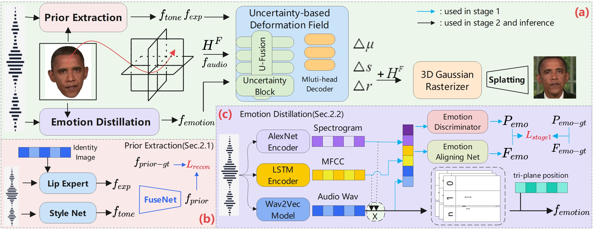
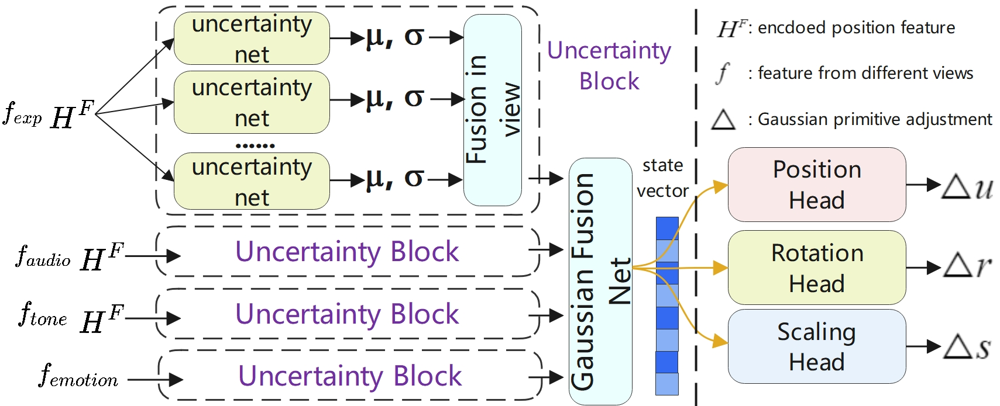
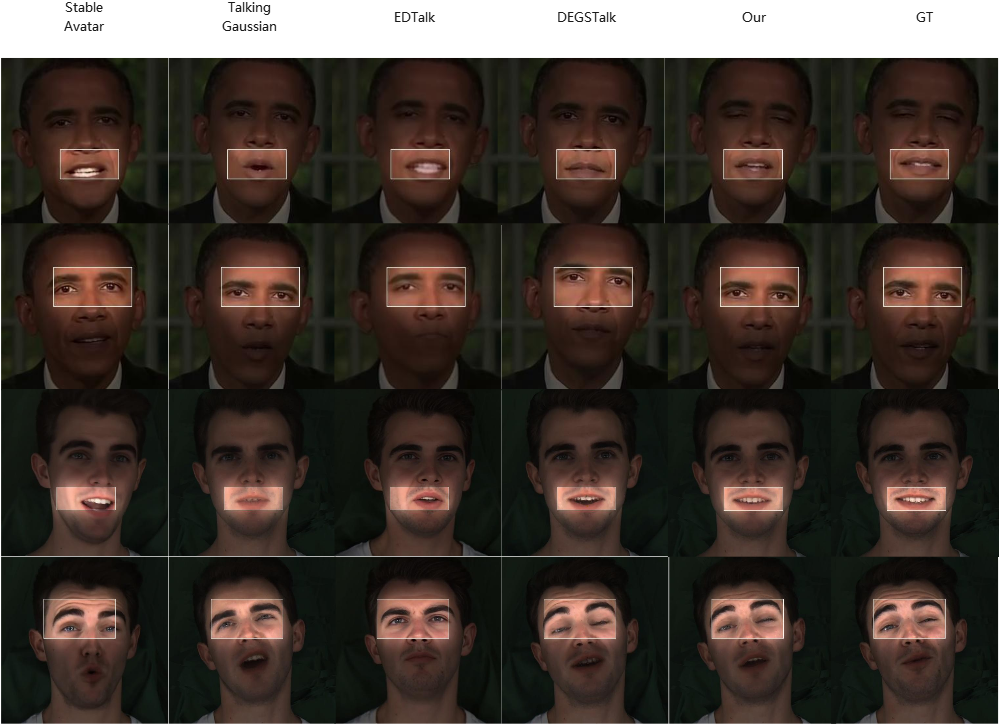

# Uncertainty-Aware 3D Emotional Talking Face Synthesis with Emotion Prior Distillation

<em>Nanhan Shen, Zhilei Liu</em>

College of Intelligence and Computing, Tianjin University, Tianjin, China

  <a href="https://github.com/Mrask999/UA-3DTalk/tree/main" target="_blank">
    <button style="
      padding: 10px 18px;
      font-size: 16px;
      border-radius: 6px;
      border: none;
      background-color: #4CAF50;
      color: white;
      cursor: pointer;
    ">
      🌐 Core Code
    </button>
  </a>

## Brief Introducing
---

  Video coming soon!

 
## Abstract & Method
---

  Emotional Talking Face synthesis is pivotal in multimedia and signal processing, yet existing 3D methods suffer from two critical challenges: poor audio-vision emotion alignment, manifested as difficult audio emotion extraction and inadequate control over emotional micro-expressions; and a one-size-fits-all multi-view fusion strategy that overlooks uncertainty and feature quality differences, undermining rendering quality. We propose UA-3DTalk, Uncertainty Aware 3D Emotional Talking Face Synthesis with emotion prior distillation, which has three core modules: the Prior Extraction module disentangles audio into content-synchronized features for alignment and person-specific complementary features for individualization; the Emotion Distillation module introduces a multi-modal attention-weighted fusion mechanism and 4D Gaussian encoding with multi-resolution code-books, enabling fine-grained audio emotion extraction and precise control of emotional micro-expressions; the Uncertainty-based Deformation deploys uncertainty blocks to estimate view-specific aleatoric (input noise) and epistemic (model parameters) uncertainty, realizing adaptive multi-view fusion and pairing a multi-head decoder for Gaussian primitive optimization to fix uniform-weight fusion flaws. Extensive experiments on regular and emotional datasets show UA-3DTalk outperforms state-of-the-art methods like DEGSTalk and EDTalk by 5.2% in E-FID foremotion alignment, 3.1% in SyncC for lip synchronization, and 0.015 in LPIPS for rendering quality.

## Uncertainty-based Fusion
---

  We carefully designed uncertainty-based fusion module, where both AU and EU have been taken into consideration. The details can be found in our paper.

## Results
---

  We provided a high-resolution version of Picture 3 in our paper to support our conclusion and demonstrate efficiency of our work.

## Compute Cost
---

  Compared with our baseline (Data pre-process is not included), our training time has increased by an average of 35 minutes on HDTF(45min -> 1h20min) and 55 minutes on MEAD(1h15min -> 2h10min).

## Contact
---

  If you have any questions, please feel free to contact us at 2024433009@tju.edu.cn.

